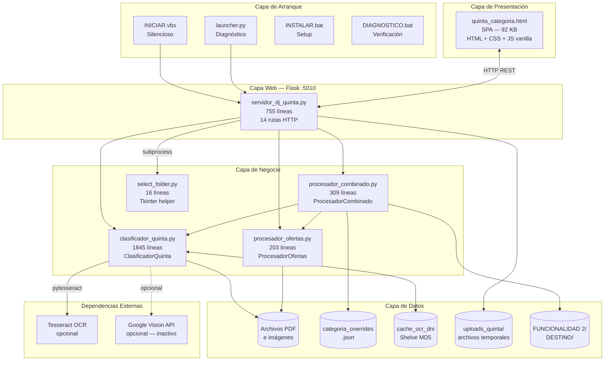
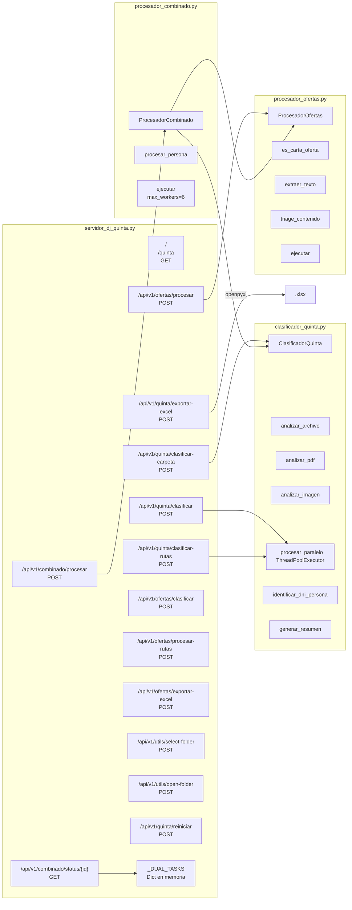
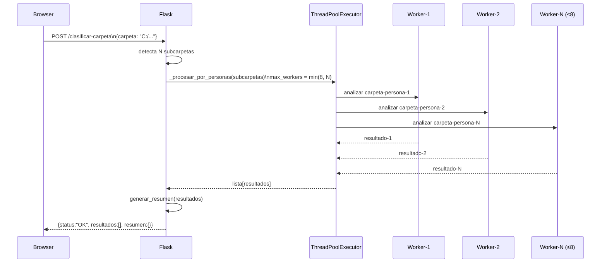
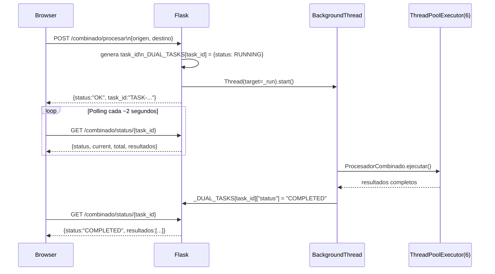
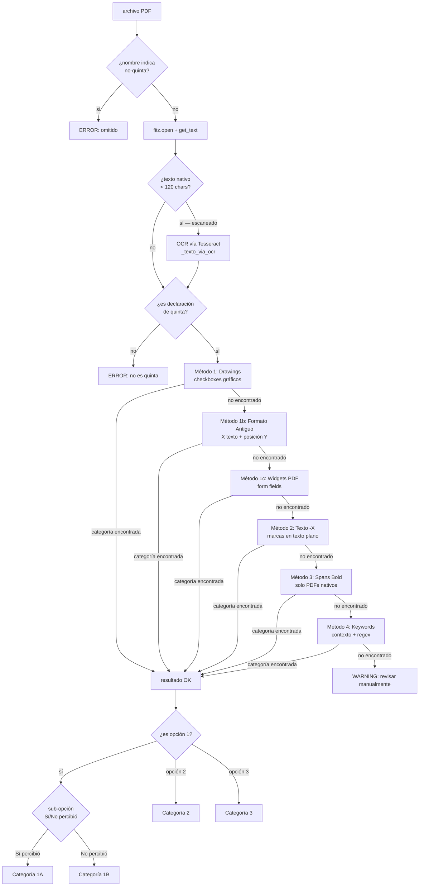
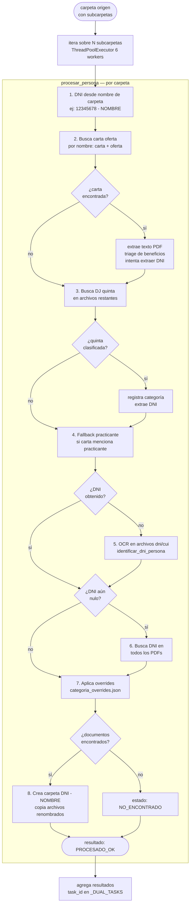
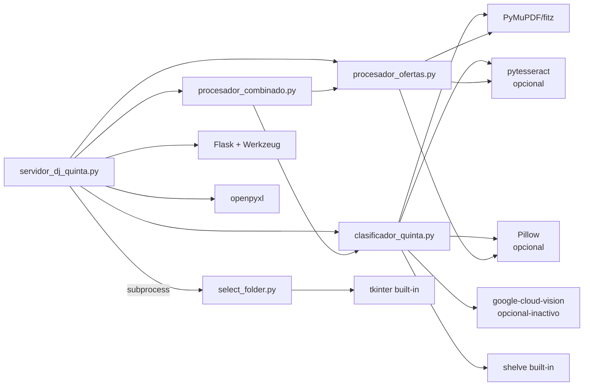
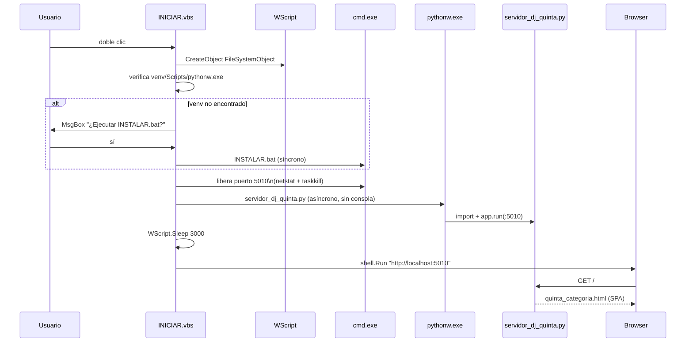

# Arquitectura del Sistema — DJ Quinta Categoría
**People Analytics · USIL**
**Documento:** ARQUITECTURA.md · v1.0 · 2026-06-01

---

## 1. Visión General

El sistema sigue una arquitectura de **aplicación web local de capa única** (monolito liviano), donde un servidor Flask actúa como hub central que:
- Sirve la interfaz de usuario (Single Page Application estática)
- Expone una API REST interna consumida por esa misma SPA
- Orquesta módulos de negocio especializados en análisis documental

No existe base de datos relacional, ni autenticación, ni conexión a servicios externos (salvo la integración opcional con Google Cloud Vision, inactiva por defecto). Todo opera en `localhost`.

```
┌────────────────────────────────────────────────────────────────────┐
│                        MÁQUINA DEL USUARIO                        │
│                                                                    │
│  ┌──────────────┐     HTTP :5010      ┌───────────────────────┐   │
│  │   Navegador  │ ◄──────────────────► │  Flask (servidor_dj_  │   │
│  │   (Chrome /  │                      │  quinta.py)           │   │
│  │   Edge / FF) │                      │                       │   │
│  └──────────────┘                      │  ┌─────────────────┐  │   │
│                                        │  │  clasificador_  │  │   │
│  ┌──────────────┐                      │  │  quinta.py      │  │   │
│  │  INICIAR.vbs │──► pythonw.exe ─────►│  └─────────────────┘  │   │
│  │  launcher.py │                      │  ┌─────────────────┐  │   │
│  └──────────────┘                      │  │  procesador_    │  │   │
│                                        │  │  combinado.py   │  │   │
│  ┌──────────────┐                      │  └─────────────────┘  │   │
│  │  select_     │◄── subprocess ───────│  ┌─────────────────┐  │   │
│  │  folder.py   │                      │  │  procesador_    │  │   │
│  └──────────────┘                      │  │  ofertas.py     │  │   │
│                                        │  └─────────────────┘  │   │
│  ┌──────────────┐                      └───────────────────────┘   │
│  │  Sistema de  │◄── shelve / shutil / fitz / pytesseract          │
│  │  archivos    │                                                   │
│  └──────────────┘                                                   │
└────────────────────────────────────────────────────────────────────┘
```

---

## 2. Modelo de Capas



---

## 3. Diagrama de Componentes



---

## 4. Modelo de Concurrencia

El sistema usa **hilos de Python** (`threading.Thread` + `ThreadPoolExecutor`) para el paralelismo de I/O-bound (lectura de PDFs, OCR con Tesseract). Tesseract libera el GIL de Python durante el procesamiento, por lo que el paralelismo real es efectivo.



**Tarea de larga duración (proceso combinado):**



---

## 5. Pipeline de Clasificación PDF

Para cada archivo PDF, se ejecutan hasta 6 métodos de detección en cascada. El primero que produce un resultado con confianza suficiente corta la ejecución.



---

## 6. Pipeline del Proceso Combinado



---

## 7. Diagrama de Dependencias entre Módulos



---

## 8. Modelo de Datos — Objeto Resultado de Clasificación

Todos los endpoints de clasificación retornan resultados con el siguiente esquema:

```mermaid
classDiagram
    class ResultadoClasificacion {
        +String status         "OK | WARNING | ERROR"
        +String archivo        "nombre del archivo analizado"
        +String nombre         "nombre extraído del documento"
        +String persona        "nombre extraído de la carpeta padre"
        +String dni            "DNI/CE extraído (8-12 dígitos)"
        +String categoria      "1A | 1B | 2 | 3 | PRACT | null"
        +Dict categoria_info   "{codigo, nombre, descripcion, color}"
        +Float confianza       "0-100 — nivel de certeza de la clasificación"
        +String metodo         "técnica usada: drawings | texto_-X | etc."
        +String mensaje        "descripción legible del resultado"
    }

    class ResumenClasificacion {
        +Int total_procesados
        +Int exitosos
        +Int errores
        +Int sin_clasificar
        +Dict categorias       "{1A:N, 1B:N, 2:N, 3:N}"
        +Dict detalle_categorias
    }

    class ResultadoCombinado {
        +String persona        "nombre de carpeta de persona"
        +String dni            "DNI resuelto"
        +String carta_oferta   "nombre del archivo de carta"
        +String dj_quinta      "nombre del archivo de quinta"
        +String categoria      "categoría asignada"
        +Dict categoria_info
        +Float confianza_quinta
        +List terminos_carta   "beneficios detectados"
        +String estado         "PROCESADO_OK | NO_ENCONTRADO | ERROR_COPIA"
        +String ruta_destino   "ruta de la carpeta generada"
        +String mensaje
    }
```

---

## 9. Flujo de Inicio del Sistema



---

## 10. Caché OCR — Diseño

El caché usa Python `shelve` (wrapper sobre `dbm`) con clave **MD5 de los primeros 128 KB** del archivo. Esto garantiza:
- Respuesta instantánea en re-ejecuciones (mismo archivo → misma clave)
- Invalidación automática si el contenido cambia (diferente MD5 → miss)
- Cero dependencias externas (built-in Python)

```
archivo.pdf → MD5(primeros 128 KB) → "a3f8c2..."
                                          │
                                    shelve.open(cache_ocr_dni)
                                          │
                             ┌────────────┴──────────────┐
                             │ hit                       │ miss
                             ▼                           ▼
                    datos guardados              OCR Tesseract
                    {apellidos, prenombres,      → guardar resultado
                     numero, sexo, ...}          → retornar datos
```

**Limitación conocida:** El caché no tiene TTL ni límite de tamaño. En uso prolongado puede crecer de forma ilimitada. Se recomienda eliminarlo manualmente si supera 100 MB (`del cache_ocr_dni.*`).

---

## 11. Decisiones de Diseño Relevantes

| Decisión | Alternativa considerada | Razón elegida |
|----------|------------------------|---------------|
| Flask monolito local | FastAPI / Electron nativo | Simplicidad de despliegue: un solo `pip install`, funciona sin Node.js |
| `shelve` para caché | Redis / SQLite | Cero dependencias, no requiere servidor externo |
| Hilos (ThreadPoolExecutor) | Multiprocessing | Tesseract libera GIL; hilos son suficientes para I/O-bound OCR |
| `pythonw.exe` como runtime | `python.exe` | Sin ventana de consola visible al usuario |
| SPA sin framework | React / Vue | Portabilidad total: un solo archivo HTML autónomo |
| Subprocess para diálogo de carpeta | Tkinter en el hilo Flask | Tkinter bloquea el event loop de Flask en modo threading |
| `shutil.copy2` en proceso combinado | `shutil.move` | No destructivo; el origen se mantiene intacto ante fallos |
